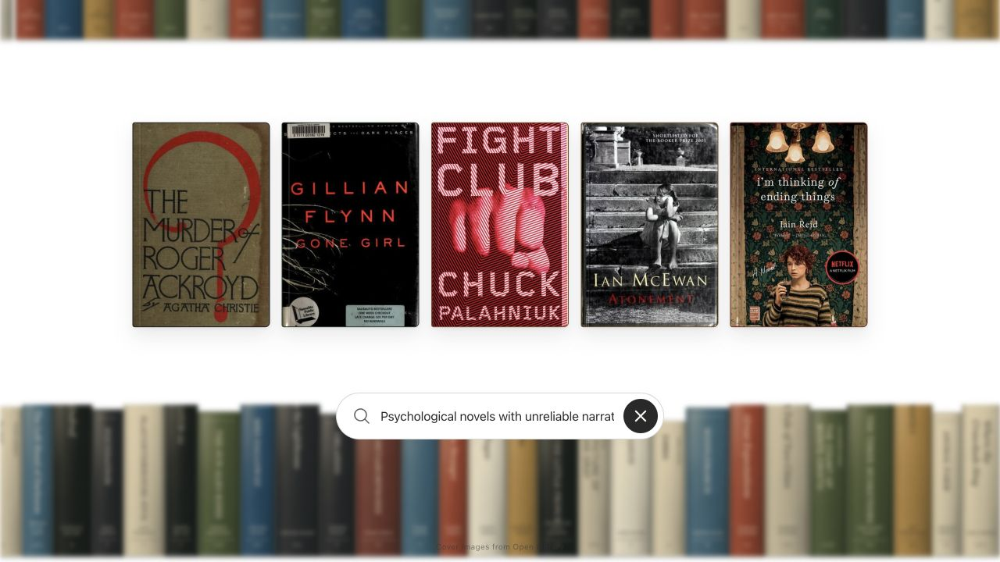

# Jev Bookshelf

A visual semantic book-search experiment powered by TypeSafe AI's Jev.

The interface presents a moving wall of book spines. Natural-language searches shortlist relevant books locally, ask Jev to rank them, and pull the five strongest matches into cover view.

## Demo

[Try the live bookshelf](https://jevreads.vercel.com/).

The homepage pairs moving book spines with cycling search suggestions.


Search results bring matching covers forward while the background shelves blur. This example searches for psychological novels with unreliable narrators.



## What is included

- An exactly 1,000-book English-language catalog: 500 fiction and 500 nonfiction
- Twenty balanced categories with modern, recognizable titles
- 995 real Open Library covers with generated fallbacks for the remaining five
- Two continuously moving, opposite-direction shelf rows
- Natural-language Jev search with deterministic offline demo queries
- Animated spine-to-cover results, responsive mobile layout, and reduced-motion support
- A paginated catalog audit page with text, collection, category, and decade filters

Try:

- `Harry Potter books featuring Severus Snape`
- `Dystopian books about surveillance and authoritarian control`
- `Psychological novels with unreliable narrators`

Without an API key, those curated examples continue to work locally. With a TypeSafe key, Jev can rank any query.

## Run locally

```bash
npm install
cp .env.example .env.local
npm run dev
```

Open [http://localhost:3000](http://localhost:3000). Add the TypeSafe key to `.env.local`:

```bash
TYPESAFE_API_KEY=your_key_here
```

The key is read only by the `/api/search` server route and is never bundled into the browser.

During `npm run dev`, press **Ctrl + Shift + B** to show or hide the blur slider (hidden by default). Its saved browser preference applies only in development. Production builds do not render the controls or register the shortcut. The idle background defaults to 0px blur and smoothly transitions to 3px while results are displayed; clearing results restores the idle blur.

Open [http://localhost:3000/catalog](http://localhost:3000/catalog) to inspect the catalog and its Open Library records.

## UI comparison

The empty search field cycles through four showcase prompts from `data/showcase-queries.ts`, resting for 2 seconds before a 300ms flip. Suggestions are decorative placeholders, never submitted as input. Focusing the field pauses the cycle; typing hides it. Reduced-motion settings replace the flip with a fade.

The UI Agentic polish pass is now the homepage design. [http://localhost:3000/ui-agentic](http://localhost:3000/ui-agentic) remains available and uses the same shared theme, real search, catalog, shelf samples, and interactions; it does not use separate sample data or a different search service.

The shared CSS Module in `components/bookshelf-theme.module.css` uses native system typography, regular-weight search text, readable 12px captions, restrained book shadows, and neutral focus indicators with no blue ring. Both bookshelf routes use it; the catalog retains its own styling. `/ui-agentic` is unlinked from the homepage and marked `noindex`, but it is a public route, not a private or authenticated page.

## Search architecture

1. A deterministic in-memory index scores the 1,000 records by title, author, people, genre, subject, and place.
2. The index returns at most 100 candidates, with a balanced popularity fallback when lexical matching is sparse.
3. One compact Jev request ranks only those candidates.
4. The server discards unknown IDs, sorts calibrated probabilities, and returns five display-ready books.
5. The client receives no full-catalog lookup table; the homepage receives only two fixed 36-book shelf samples.

## Catalog maintenance

The generated catalog is in `data/catalog.json`; its quality report is in `data/catalog-report.json`. Rebuild it with cached Open Library responses:

```bash
npm run catalog:build
```

Force fresh API responses only when needed:

```bash
node scripts/build-catalog.mjs --target 1000 --refresh
```

The builder runs a cached Source → Filter → Score → Select → Report pipeline. It preserves the original 200 records, throttles Open Library requests, rejects low-quality derivatives, collapses duplicate works, limits authors to eight books, validates the completed catalog, and writes atomically only after all invariants pass. Cover images remain remote; the repository stores only cover IDs.

## Verify

```bash
npm test
npx tsc --noEmit
npm run build
npx playwright install chromium webkit
npm run test:e2e
```

See [production safeguards](docs/production-safeguards.md) for responsive CI coverage, security protections and best-effort in-memory rate limits. No Redis or additional service configuration is needed.

## Stack

- Next.js 16 and TypeScript
- React 19 and Motion
- Tailwind CSS
- TypeSafe AI Jev
- Open Library metadata and covers

## Version control

Completed features and fixes are verified, saved in small local Git commits, and pushed to the configured GitHub remote. Commit messages use Conventional Commits such as `feat:`, `fix:`, and `docs:`. Larger changes use short-lived `codex/` branches for review.

Credentials remain local in `.env.local`; dependencies, build output, API caches, and TypeScript build-info files are ignored. Repository instructions in `AGENTS.md` preserve this workflow for future development sessions.

## License and security

Project code is available under the [MIT License](LICENSE). Third-party dependencies,
Open Library metadata, and remote book-cover artwork retain their respective rights
and terms; the project license does not grant rights to that third-party material.

Please report vulnerabilities privately using the process in [SECURITY.md](SECURITY.md).
